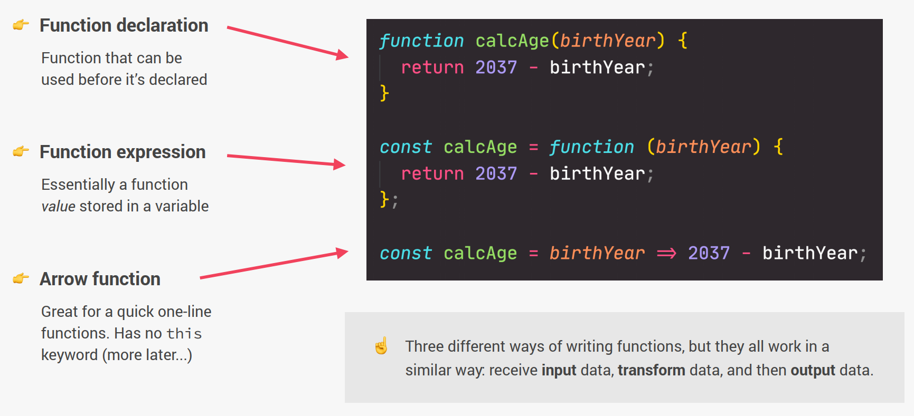

# Xử lý bất đồng bộ trong Javascript

---

<!--  -->

## 1. Các loại Functions : Xem mục [Các loại Function](./asset/01/functions.md)

- Declare Function : Xem mục [Declare Function](./asset/01/declare.md) - Định nghĩa hàm
- Expressions Function : Xem mục [Expressions Function](./asset/01/expressions.md) - Biểu thức hàm
- Arrow Function : Xem mục [Arrow Function](./asset/01/arrow.md) - Hàm mũi tên

## 2. Arrow Function

- Xem mục [Arrow Function](./asset/02/arrow-function.md)

## 3. Bất đồng bộ là gì?

- Xem mục [Bất đồng bộ](./asset/03/sync-async.md)

## 4. Tìm hiểu bất đồng bộ từ setTimeout()

- Xem mục [Promise](./asset/05/index.md)
- Xem mục [setTimeOut](./asset/04/set-time-out.md)

## 5. ReadFile và ReadFileSync trong NodeJS

- Xem mục [ReadFile và ReadFileSync](./asset/05/readfilesync.md)

## 6. Callback

- Xem [Callback](./asset/06/index.md)

## 7. Callback hell

- Xem [Callback hell](./asset/07/index.md)

## 8. Promise Basic

- Xem [Promise](./asset/08/infor-promise.md)
- Xem [Promise Basic](./asset/08/index.md)

## 9. Tái sử dụng Promise

- Là việc viết lại câu lệnh function có sử dụng promise và truyền vào các tham số để thuận tiện sử dụng.
- Xem [Tái sử dụng Promise](./asset/09/index.md)

## 10. Promise liên tục

- Xem [Promise liên tục](./asset/10/index.md)

## 11. Promise status và Promise value

- Ở các bài trước ta sử dụng Promise trên máy chủ backend NodeJS.
- Bài này sẽ hướng dẫn thao tác sử dụng Promise trên client cụ thể .html ở trình duyệt.
<!--  -->
- Xem [Promise status và Promise value](./asset/11/index.md)

## 12. Phương thức resolve và reject

- Nghiên cứu thêm về phương thức resolve và reject của Promise khi thực hiện ở:
- Server: NODE
- Client phản hồi.
- Xem [Phương thức resolve và reject](./asset/12/index.md)

## 13. Phương thức Promise.all và Promise.race

- Phương thức xử lý Promise.all và Promise.race
- Xem [Phương thức all và race](./asset/13/index.md)
- Xem [Promise.all](./asset/13/pr-all.md)

## 14. node co

- Hướng dẫn dùng `co module` để viết `Promise code` gọn gàng hơn
- Xem [node co](./asset/14/index.md)

## 15. Async Await

- Phương thức `Async Await`
- Hướng dẫn sử dụng `Async Await` để thay thế `co module`
- Xem [Async Await](./asset/15/index.md)
- Ví dụ [Load Async Await](./asset/15/vidu.md)

## 16. Cùng tìm hiểu về Npm và package

- Tìm hiểu về cách khai báo khởi tạo dự án `NodeJS` và cách cài đặt các gói `Node Package`
- Xem [Npm và package](./asset/16/index.md)

## 17. Sử dụng Babel CLI

- Vì NodeJS vẫn chưa hỗ trợ toàn diện cho Async/Await nên sẽ dùng gói Package của NodeJS là `Babel CLI` (Babel Command Line Interface)
- Xem [Cài đặt gói Babel CLI](./asset/17/index.md)

## 18. Làm quen với Async – Await

- Xem [Làm quen với Async – Await](./asset/18/index.md)

## 19. Async – Await trong NodeJS 7.6

- Xem [Async – Await trong NodeJS 7.6](./asset/19/index.md)
<!--  -->

## 20. Tìm hiểu Async – Await bất đồng bộ

- Xem [Tìm hiểu Async – Await bất đồng bộ](./asset/20/index.md)

## 21. Sử dụng Async – Await liên tiếp

- Xem [Sử dụng Async – Await liên tiếp](./asset/21/index.md)

## 22. Async function trả về promise

- Xem [Async function trả về promise](./asset/22/index.md)
